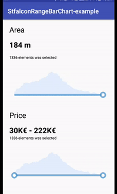

# Stfalcon-PriceRangeBar


## Who we are
Need iOS and Android apps, MVP development or prototyping? Contact us via info@stfalcon.com. We develop software since 2009, and we're known experts in this field. Check out our portfolio and see more libraries from stfalcon-studio.
## Download
Download via Gradle: 
```compile 'com.github.stfalcon:pricerangebar:0.1.0'```
## Usage
For adding default seekbar with chart just put this code into your layout:
```
<com.stfalcon.pricerangebar.SeekBarWithChart
   android:layout_width="match_parent"
   android:layout_height="wrap_content"/>
```
Or you can use default rangebar with chart just put this code into your layout:
```
<com.stfalcon.pricerangebar.RangeBarWithChart
   android:layout_width="match_parent"
   android:layout_height="wrap_content"/>
```
After that you should to add list entries with data to displaying

```
val seekBarEntries = ArrayList<SeekBarEntry>()

seekBarEntries.add(SeekBarEntry(30.0f, 5.0f))
seekBarEntries.add(SeekBarEntry(32.0f, 7.0f))
seekBarEntries.add(SeekBarEntry(34.0f, 10.0f))
seekBarEntries.add(SeekBarEntry(36.0f, 11.0f))
seekBarEntries.add(SeekBarEntry(38.0f, 14.0f))
seekBarEntries.add(SeekBarEntry(40.0f, 15.0f))

seekBar.setEntries(seekBarEntries)
```
You can use many attributes for more flexibility and convenience of use. Here's the full list:
- barActiveLineColor - color of selected part of rangebar/seekbar
- barLineColor - color of unselected part of rangebar/seekbar
- barThumbColor - color of thumb
- barActiveThumbColor - color of active radius in thumb
- barActiveTickRadius - clicked size of thumb
- barChartSelectedBackgroundColor - background color of selected part of chart
- barChartSelectedLineColor - color of selected part of top line in chart
- barChartUnSelectedLineColor - color of unelected part of top line in chart
- barChartUnselectedBackgroundColor - background color of unelected part of chart

For example:
```
<com.stfalcon.pricerangebar.SeekBarWithChart
    android:id="@+id/seekBar"
    android:layout_width="match_parent"
    android:layout_height="wrap_content"
    app:seekActiveLineColor="@android:color/holo_orange_dark"
    app:seekActiveThumbColor="@android:color/holo_blue_light"
    app:seekActiveTickRadius="@dimen/custom_active_tick_radius"
    app:seekChartSelectedBackgroundColor="@android:color/holo_red_dark"
    app:seekChartSelectedLineColor="@android:color/holo_green_dark"
    app:seekChartUnSelectedLineColor="@android:color/holo_green_light"
    app:seekChartUnselectedBackgroundColor="@android:color/holo_red_light"
    app:seekLineColor="@android:color/holo_blue_light"/>
```
If you want to observe any changes in seekbar you should to add callbacks like:
- ```onPinPositionChanged```
- ```onSelectedEntriesSizeChanged```
- ```onSelectedItemsSizeChanged```

If you want to observe any changes in rangebar you should to add callbacks like:
- ```onRangeChanged```
- ```onLeftPinChanged```
- ```onRightPinChanged```
- ```onSelectedEntriesSizeChanged```
- ```onSelectedItemsSizeChanged```

Let's take look a small sample for seekbar:
```
seekBar.onPinPositionChanged = { index, pinValue ->
    println("$pinValue $index")
}
seekBar.onSelectedEntriesSizeChanged = { selectedEntriesSize ->
    println("$selectedEntriesSize column was selected")
}
seekBar.onSelectedItemsSizeChanged = { selectedItemsSize ->
    println("selectedItemsSize elements was selected")
}
```
And for rangebar:
```
rangeBar.onRangeChanged = { leftPinValue, rightPinValue ->
    println("$leftPinValue $rightPinValue")
}
rangeBar.onLeftPinChanged = { index, leftPinValue ->
    println("$index $leftPinValue")
}
rangeBar.onRightPinChanged = { index, rightPinValue ->
    println("$index $rightPinValue")
}
rangeBar.onSelectedEntriesSizeChanged = { selectedEntriesSize ->
    println("$selectedEntriesSize column was selected")
}
rangeBar.onSelectedItemsSizeChanged = { selectedItemsSize ->
    println("$selectedItemsSize elements was selected")
}
```
## License
```
Copyright 2018 stfalcon.com

Licensed under the Apache License, Version 2.0 (the "License");
you may not use this file except in compliance with the License.
You may obtain a copy of the License at

    http://www.apache.org/licenses/LICENSE-2.0

Unless required by applicable law or agreed to in writing, software
distributed under the License is distributed on an "AS IS" BASIS,
WITHOUT WARRANTIES OR CONDITIONS OF ANY KIND, either express or implied.
See the License for the specific language governing permissions and
limitations under the License.
```
